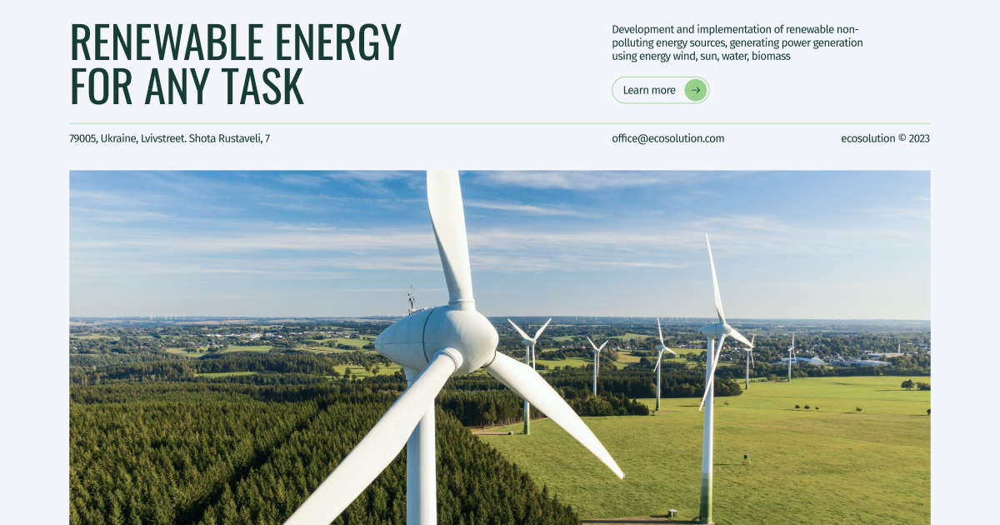

# Ecosolution

Is a website dedicated to environmental solutions and sustainable development. The site provides users with information about innovative environmental technologies, projects and solutions aimed at preserving the environment.
You can view it [here](https://ecosolution-ebon.vercel.app/).

## Technologies
- Next.js
- ReactJS
- Libraries:
    - react-hook-form
    - react-hook-form-persist
    - react-scroll
    - react-hot-toast
- Swiper
- Tailwind CSS
- Vercel

## Layout
- Fixed layout in pixels (px).
- Semantic and valid structure.
- Layout is adaptive and cross-browser - mobile from 360px to 480px (rubber layout), tablet - 768px, desktop - 1280px.
- Mobile first approach is used.

## Functionality

### Header
- Fixed. Contains logo, burger menu, Get in touch (except mobile version).
- When you click on Get in touch, there is a smooth scroll to the Contact Us section.

### Main
- Clicking on Learn more scrolls smoothly to the Cases section.

### About (Values)
- I use CSS Grid when creating a list of values.

### Electricity
- Automatic counter +1 per second

### Cases
- Infinite slider.
- You can change the slide by clicking on the appropriate buttons or by dragging.
- When you click on the button, one slide is clicked.

### FAQ
- By default, the first answer is open.
- Clicking on Contact Us scrolls smoothly to the Contact Us section.

### Contact Us
- The form is validated.
- The fields of the Full name, E-mail, Phone form are mandatory, the Message field is optional.

### Footer
- Contains an arrow that, when clicked, smoothly scrolls to the Main section.

## Contribution

If you have ideas for improving this website, you can create a pull request or open an issue in [repository](https://github.com/Ira-Bughaichuk/ecosolution)

You are free to use, modify and distribute this website.

Thank you for using the Coffee House!

## Running the Project

To run the project, follow these steps:

[Clone the project repository](https://github.com/Ira-Bughaichuk/ecosolution) to your local computer.

Open a terminal and navigate to the project folder.

Install project dependencies **npm install**

Start the development server **npm run dev**

Open [http://localhost:3000](http://localhost:3000) with your browser to see the result.

You can start editing the page by modifying `app/page.js`. The page auto-updates as you edit the file.

This project uses [`next/font`](https://nextjs.org/docs/basic-features/font-optimization) to automatically optimize and load Inter, a custom Google Font.

This is a [Next.js](https://nextjs.org/) project bootstrapped with [`create-next-app`](https://github.com/vercel/next.js/tree/canary/packages/create-next-app).

